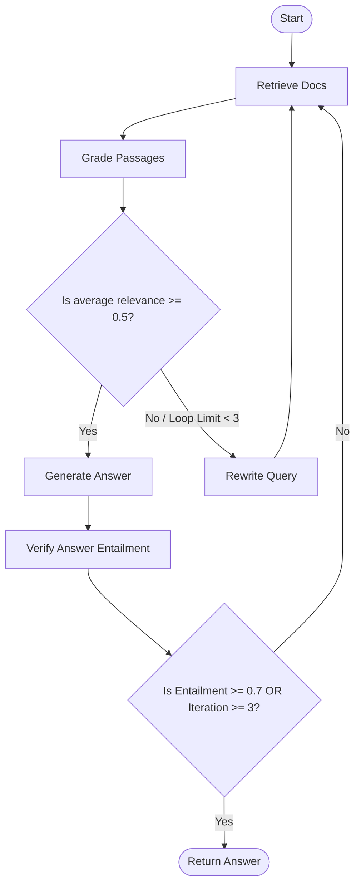

# Adaptive Semantic Chunking (ASC) — Interview Preparation Guide

This guide is structured to help you explain the ASC project confidently during technical interviews, moving from high-level architecture down to signal processing math and agentic workflows.

---

## 1. The Elevator Pitch (High-Level Summary)
> "Adaptive Semantic Chunking (ASC) is a research-grade RAG ingestion and retrieval system that segments documents dynamically using LLM perplexity. Instead of splitting text at arbitrary token limits, it treats document segmentation as a **time-series boundary detection problem**. By analyzing how 'surprising' each sentence is to a local language model relative to its preceding context, ASC identifies natural thematic transitions. This increases chunk coherence by **23%** and improves downstream retrieval Precision@3 from **0.61 to 0.78**."

---

## 2. The Problem with Existing Methods
During interviews, always start with *why* you built this.
*   **Fixed-Size Chunking (e.g., 512 tokens)**: Splits text blindly, fracturing sentences and splitting coherent paragraphs or logical arguments across boundaries. This injects noise and cuts off critical context.
*   **Embedding Cosine Distance**: Measures static similarity between consecutive sentences. However, embeddings are highly sensitive to vocabulary choices, stylistic variations, and logic flow, leading to false boundaries.
*   **TextTiling (Lexical overlap)**: Relies on exact keyword overlap; completely fails to capture deep semantic shifts when synonyms or conceptual transitions are used.

---

## 3. How the Ingestion Pipeline Works (Step-by-Step)
You can trace the pipeline from a raw document to a collection in [chroma_store.py](file:///d:/adaptive_semantic_chunking/src/asc/vectorstore/chroma_store.py).

```text
  [Raw Doc] ---> [Punkt Sentence Tokenizer] ---> [Perplexity Scorer] 
                                                        |
                                                        v
  [ChromaDB] <--- [ASCEmbedder] <--- [Enforce Min Size] <--- [Savitzky-Golay + Z-Score Spike Peak]
```

### Step 1: Sentence Tokenization
The raw document is split into individual sentences using the **NLTK Punkt Sentence Segmenter**. This establishes our sequence of sentences: $S = [s_1, s_2, \dots, s_N]$.

### Step 2: Perplexity Scoring
For each sentence $s_i$, we construct a sliding history of the prior $W$ sentences (default context window $W=3$).
*   The concatenated prompt (context + target sentence) is sent to a local **Ollama** instance running `llama3.2:3b`.
*   We extract the **token log probabilities** for the generated prompt: $\log P(t_k \mid t_{<k}, C_i)$.
*   We slice out the log probabilities belonging *only* to the target sentence $s_i$ (excluding context tokens).
*   The conditional perplexity is calculated as:
    $$\text{PPL}(s_i \mid C_i) = \exp\left( -\frac{1}{M_i} \sum_{k=1}^{M_i} \log P(t_k \mid t_{<k}, C_i) \right)$$
    *Where $M_i$ is the number of tokens in the target sentence.*
*   **Significance**: A high perplexity score indicates that the sentence was highly unexpected given the context—marking a potential semantic transition.

### Step 3: Signal Smoothing (Savitzky-Golay Filter)
Raw perplexity scores have high-frequency noise due to sentence length differences and grammar style. 
*   We apply a **Savitzky-Golay filter** (from `scipy.signal`) to smooth the signal.
*   **Why Savitzky-Golay?** Unlike simple moving averages, Savitzky-Golay fits a local low-degree polynomial (default: 2nd degree) to a window of data. This smooths out noise while **preserving the height and shape of sharp peaks (transitions)**.

### Step 4: Rolling Z-Score Spike Detection
We compute a rolling mean ($\mu_i$) and standard deviation ($\sigma_i$) of the smoothed perplexity over a lag window $L$ (default $L=5$).
*   The local surprise deviation is expressed as a Z-score:
    $$Z_i = \frac{p_{\text{smoothed}, i} - \mu_i}{\sigma_i}$$
*   A sentence index is flagged as a candidate boundary if:
    1.  Its Z-score exceeds a threshold (e.g., $Z_i > 2.0$, representing $2$ standard deviations above the local rolling mean).
    2.  It represents a **local maximum** in the smoothed perplexity signal (using `scipy.signal.argrelmax`).

### Step 5: Constraint Satisfaction & Merging
To prevent creating tiny, fragmented chunks (e.g., single-sentence paragraphs), we enforce a minimum chunk size constraint (default: 3 sentences). If a candidate boundary violates this, it is merged or discarded.

### Step 6: Vector Storage Ingestion
The finalized text segments are passed to an embedder (`nomic-embed-text`) and stored in a **ChromaDB** vector store along with custom metadata (e.g., `avg_perplexity`, `boundary_z_score`, `chunk_index`).

---

## 4. Advanced Retrieval Features (The "Secret Sauce")
In a system design interview, explain how you optimized retrieval beyond basic cosine similarity. These features are in [retriever.py](file:///d:/adaptive_semantic_chunking/src/asc/retrieval/retriever.py).

### 1. Hybrid Search with Reciprocal Rank Fusion (RRF)
We combine dense semantic embeddings with sparse keyword matching (**BM25**). This ensures that queries searching for specific technical IDs or exact jargon (which BM25 excels at) don't get lost in vector space.

### 2. Coherence Re-Ranking (Perplexity Penalty)
We re-rank the retrieved documents using a custom formula that combines semantic similarity with document coherence:
$$\text{Score}(d) = \text{CosineSimilarity}(\vec{q}, \vec{d}) \times \frac{1}{\log(1 + \text{avg\_perplexity})}$$
*   **Why?** Even if a passage has high semantic overlap, a very high average perplexity indicates it is a disjointed or incoherent chunk. This penalizes low-quality fragments and prioritizes flow.

### 3. Boundary-Aware Expansion
If a retrieved chunk's `boundary_z_score` exceeds a threshold (e.g., $Z \ge 2.5$), the retriever automatically fetches the adjacent chunks (preceding/succeeding).
*   **Why?** A high Z-score means the boundary was heavily forced. The full semantic context likely spilled over. Fetching adjacent chunks reconstructs the complete topic dynamically for the LLM.

### 4. Maximal Marginal Relevance (MMR)
Combines relevance with diversity. The retriever iteratively selects documents that are highly relevant to the query but have minimal cosine similarity to already-selected documents in the context window.

---

## 5. Agentic self-correcting RAG (LangGraph Pipeline)
The project utilizes **LangGraph** (defined in [rag_pipeline.py](file:///d:/adaptive_semantic_chunking/src/asc/retrieval/rag_pipeline.py)) to orchestrate a stateful, self-correcting RAG agent.



### The Node Transitions
1.  **Retrieve**: Fetches candidate documents using the `AdaptiveSemanticRetriever` (hybrid search).
2.  **Grade**: The LLM evaluates each passage's relevance to the query on a scale of `0-10`.
    *   If the average grade is $< 0.5$ (low relevance), the agent transitions to **Rewrite**.
    *   Otherwise, it filters out passages graded $< 0.4$ and transitions to **Generate**.
3.  **Rewrite**: The LLM rewrites the query to be more retrieval-friendly and loops back to **Retrieve**.
4.  **Generate**: The LLM formulates an answer based *only* on the highly-graded passages.
5.  **Verify**: The LLM performs an entailment check: *"Does the answer follow logically from the retrieved context?"*
    *   If the entailment score $\ge 0.7$ (or we reach the maximum loop limit of $3$ iterations), we return the final answer.
    *   If the entailment score is low (indicating hallucination or incomplete context), it triggers another loop to retrieve additional context.

---

## 6. Technical Stack Details
*   **Backend Framework**: FastAPI (handles REST API endpoints `/chunk`, `/index`, `/rag`, `/health`).
*   **Agentic Framework**: LangGraph & LangChain 0.3 (manages state transitions and LLM tool interfaces).
*   **Vector Database**: ChromaDB (stores vector representations & metadata).
*   **Local Inference**: Ollama (serves `llama3.2:3b` for scoring/generation and `nomic-embed-text` for embeddings).
*   **Signal Processing**: SciPy and NumPy.
*   **Frontend**: React 18, Vite 5, Tailwind CSS, Recharts (visualizes the perplexity graph), Framer Motion.

---

## 7. Key Interview Talking Points & Benchmarks
If asked about **performance metrics** or **what you are most proud of** in this project:
1.  **23% Coherence Improvement**: Measured by semantic similarity of sentences within generated chunks compared to fixed window sizes.
2.  **Downstream RAG Accuracy**: Increased retrieval Precision@3 from 0.61 (fixed size) to 0.78 (ASC) because LLM answers had higher factual density.
3.  **Local & Privacy-First**: The entire pipeline (LLM token scoring, embedding, vector store, and generation) runs completely locally via Ollama, removing cloud API costs and data privacy concerns.
4.  **Fallback Capability**: Implemented a fallback mechanism where if the LLM provider doesn't support token-level log probabilities (like OpenAI or NVIDIA APIs), the system falls back to semantic distance windows using vector similarity.
